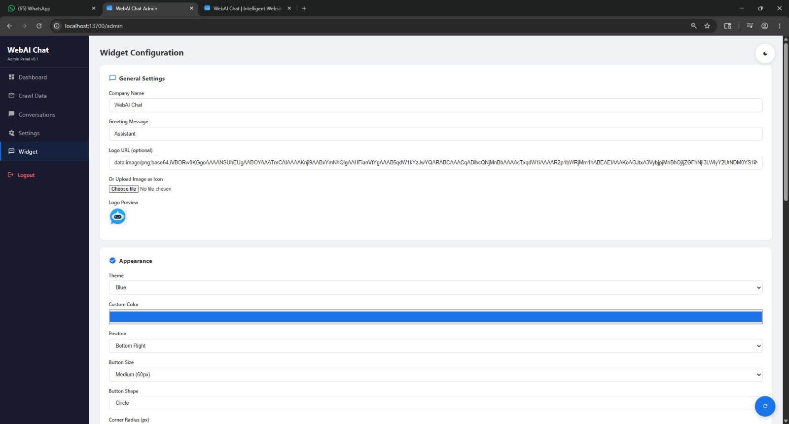
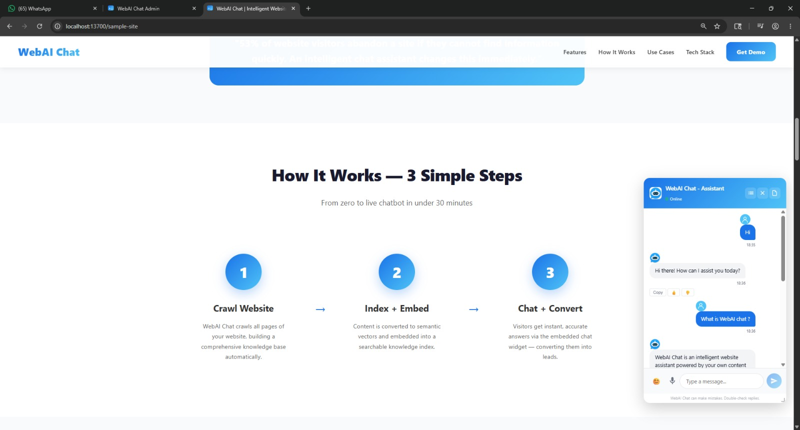
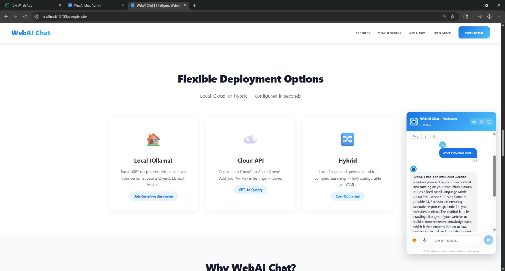
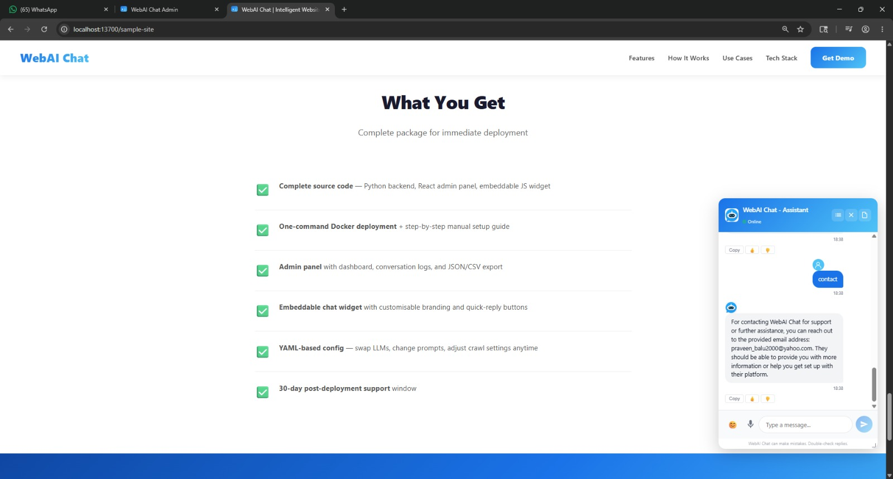
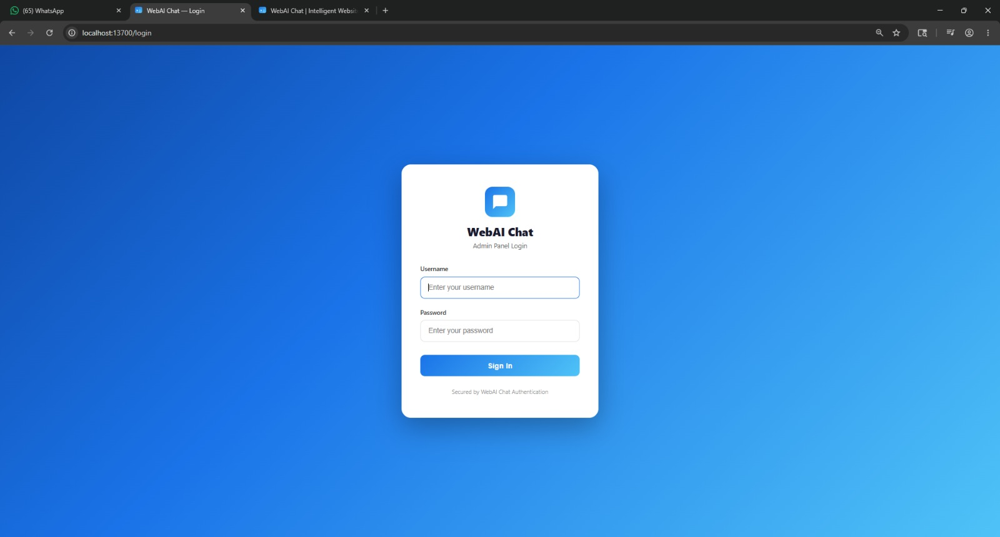
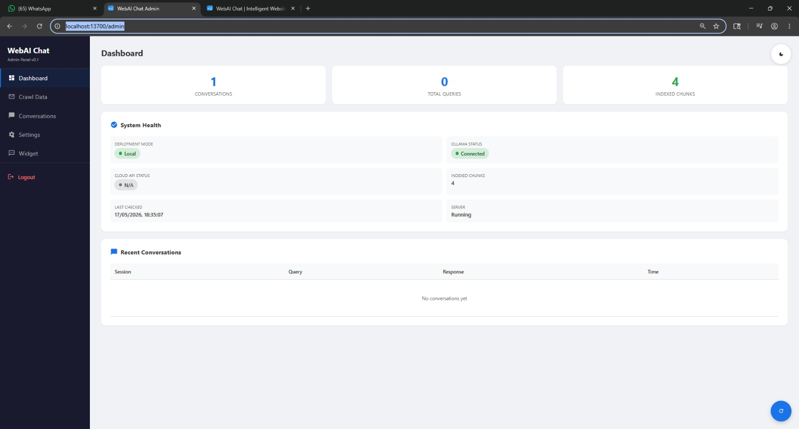
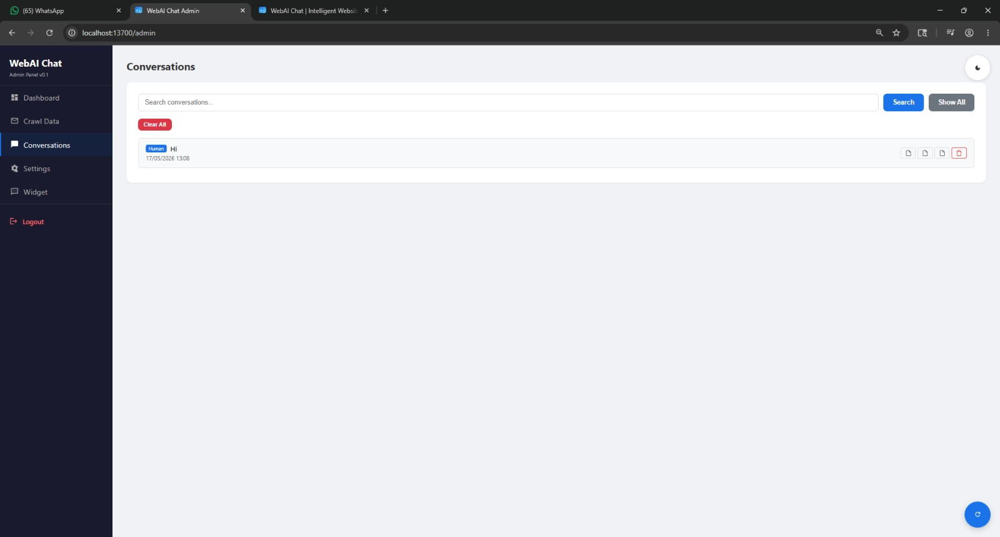
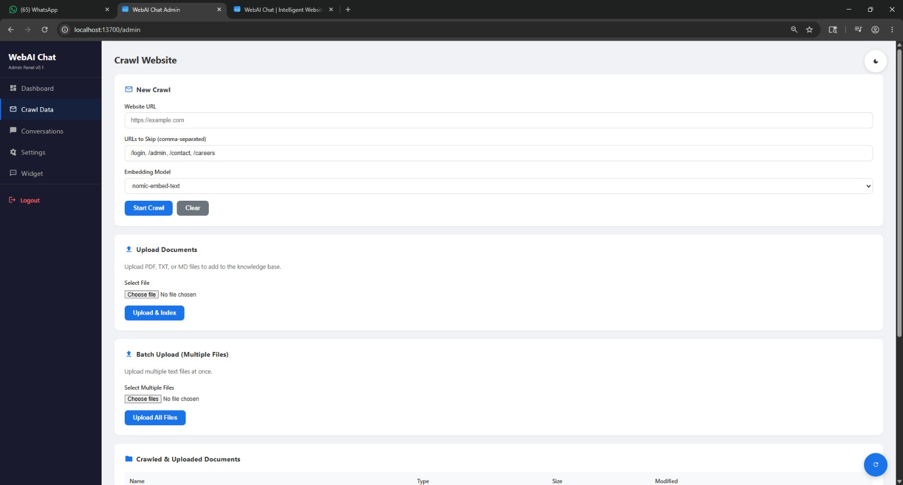
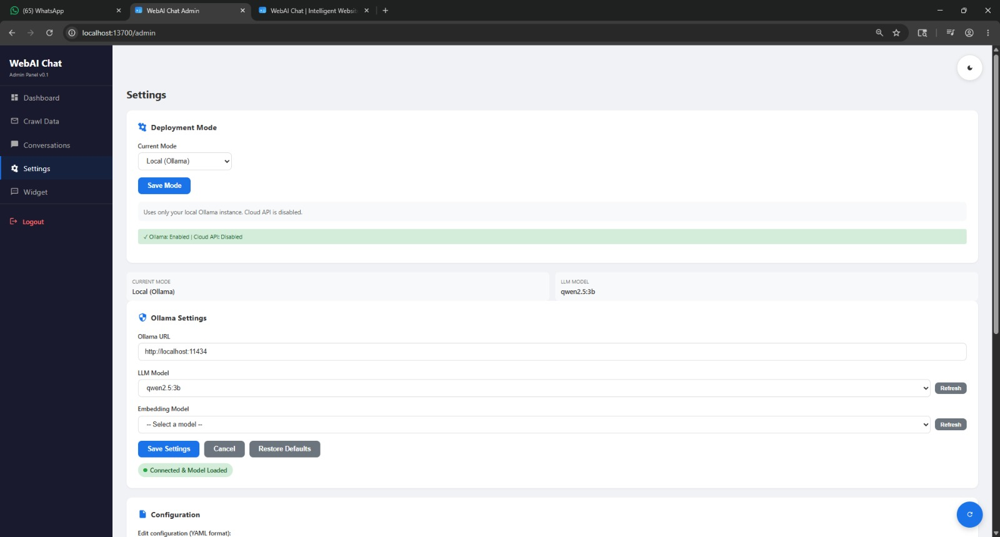
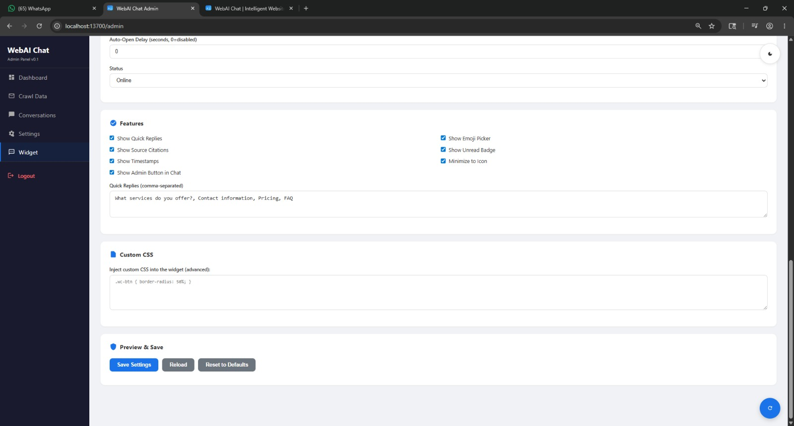

# WebAI Chat

AI-powered chatbot that answers website questions using a local SLM (Small Language Model). Deploy on your customer's server with full privacy.

## Features

- **Setup Wizard**: Browser-based GUI installer (`webaichat-wizard`) with step-by-step configuration
- **Local SLM**: Runs Qwen2.5-3B via Ollama (4GB VRAM)
- **Cloud AI**: Support for OpenAI, Anthropic, Azure, Google, Groq, and Together via LiteLLM
- **Hybrid Mode**: Local model first, cloud fallback
- **RAG**: Answers from your website content, not general knowledge
- **Web Crawler**: On-demand website crawling with configurable depth
- **Document Upload**: Upload PDF, TXT, or MD files to add to the knowledge base
- **Batch Upload**: Upload multiple text files at once
- **CLI Ingest**: Batch ingest from a folder via `webaichat ingest`
- **Widget**: Floating chat widget embeddable on any site with customizable appearance
- **Admin Panel**: Manage crawls, uploads, conversations, and system health
- **Secure Login**: Cookie-based session authentication for admin panel
- **Config Hot-Reload**: Settings update without server restart
- **Streaming Responses**: Server-sent events (SSE) for real-time chat
- **Source Citations**: Show source documents in responses
- **Deployment Files**: Auto-generate Docker, systemd, Heroku, Railway, Render configs
- **Website Snippets**: Generate embed code for any platform (HTML, WordPress, React, Vue)
- **100% Open Source**: MIT licensed, no cloud dependencies
- **Privacy-First**: All data stays on customer's server

## Screenshots

### Chat Widget & Interface

| Chat Widget | Chat Streaming | Chat Response |
|---|---|---|
|  |  |  |

| Chat with Citations | Login Page | Admin Panel |
|---|---|---|
|  |  |  |

### Admin Features

| Conversations | Crawl Page | Settings |
|---|---|---|
|  |  |  |

| Widget Configuration |
|---|
|  |

## Quick Start

### Prerequisites

- Python 3.10+
- Ollama installed: https://ollama.ai
- 4GB VRAM GPU (optional, for local SLM)

### Installation

```bash
cd WebAI-Chat
python -m venv venv
venv\Scripts\activate          # Windows
source venv/bin/activate       # Linux/macOS
pip install -r requirements.txt
pip install -e .
```

### Setup Ollama

```bash
# Install Ollama from https://ollama.ai
# Pull the language model
ollama pull qwen2.5:3b
# Pull the embedding model (uses SentenceTransformer, not Ollama)
# Embedding models are downloaded automatically on first use
```

### Configure

```bash
cp config.yaml.example config.yaml
# Edit config.yaml with your settings
```

### Run

```bash
# Start the server
webaichat serve

# Or with custom host/port
webaichat serve --host 0.0.0.0 --port 9000
```

### Crawl a Website

```bash
# Via CLI
webaichat crawl https://example.com

# Via API
curl -X POST http://localhost:9000/api/crawl \
  -H "Content-Type: application/json" \
  -d '{"url": "https://example.com"}'
```

### Upload Documents

```bash
# Via API (single file)
curl -X POST http://localhost:9000/api/upload \
  -H "Content-Type: multipart/form-data" \
  -F "file=@document.pdf"

# Via CLI (batch from directory)
webaichat ingest path/to/folder --source "my-docs"
```

### Embed the Widget

Add to any website:

```html
<script>
  window.WEBAI_CHAT_CONFIG = { apiBase: "https://webaichat.yourserver.com/" };
</script>
<script src="https://webaichat.yourserver.com/static/widget.js"></script>
```

## Admin Panel Authentication

The admin panel supports secure cookie-based session authentication for managing the chatbot. Enable it by setting credentials in `config.yaml`:

```yaml
server:
  host: "0.0.0.0"
  port: 9000
  username: "admin"
  password: "your-secure-password"
```

### How It Works

- When `username` and `password` are set, visiting `/admin` redirects to `/login`
- After successful login, a secure HTTP-only session cookie is set (8-hour timeout)
- A logout button is available in the admin panel sidebar
- When credentials are empty, admin access remains open (no authentication)
- Configuration changes take effect immediately without server restart

### Authentication Endpoints

| Method | Endpoint | Description |
|--------|----------|-------------|
| GET | `/login` | Login page |
| POST | `/api/admin/login` | Authenticate and create session |
| POST | `/api/admin/logout` | Clear session and logout |
| GET | `/api/admin/check-auth` | Check current auth status |

### Security Notes

- Passwords are hashed using bcrypt directly (not passlib, for compatibility)
- Session tokens are generated using `secrets.token_urlsafe(32)`
- Sessions expire after 8 hours automatically
- Cookies are HTTP-only to prevent XSS access
- The chat API (`/api/chat`) is separate from admin authentication

## CLI Commands

### Setup Wizard (GUI Installer)

```bash
webaichat-wizard
# or
python -m wizard
```

Opens a browser-based setup wizard at `http://localhost:8080` that guides you through:
1. System check (Python, Ollama, GPU detection)
2. Deployment mode selection (local/cloud/hybrid)
3. Server configuration (host, port, authentication)
4. AI model setup (Ollama model detection, cloud API key input)
5. Chat settings (system prompt, tokens, retrieval)
6. Crawler settings
7. Widget customization
8. Deployment target selection (Docker, systemd, Heroku, Railway, Render)
9. Website injection snippet generation
10. One-click install (dependencies, config.yaml, deployment files)

### Serve

```bash
webaichat serve
webaichat serve --host 0.0.0.0 --port 9000
```

### Crawl

```bash
webaichat crawl https://example.com
webaichat crawl https://example.com --skip /login /admin /contact
```

### Ingest (Batch Upload)

```bash
webaichat ingest path/to/folder --source "my-knowledge-base"
```

### Model Management

```bash
webaichat model pull
webaichat model check
webaichat model info
webaichat model pull --model llama3.2:3b
```

## API Endpoints

### Chat
| Method | Endpoint | Description |
|--------|----------|-------------|
| POST | `/api/chat` | Send a chat message (returns full response) |
| POST | `/api/chat/stream` | Streaming chat response (SSE) |
| GET | `/api/sessions/{id}/messages` | Get conversation history |

### Crawl & Upload
| Method | Endpoint | Description |
|--------|----------|-------------|
| POST | `/api/crawl` | Crawl a website |
| POST | `/api/upload` | Upload a document (.pdf, .txt, .md) |

### Admin Panel (requires auth)
| Method | Endpoint | Description |
|--------|----------|-------------|
| GET | `/admin` | Admin panel |
| GET | `/login` | Login page |
| POST | `/api/admin/login` | Authenticate and create session |
| POST | `/api/admin/logout` | Clear session and logout |
| GET | `/api/admin/check-auth` | Check current auth status |
| GET | `/api/admin/health` | System health |
| GET | `/api/admin/stats` | Conversation stats |
| GET | `/api/admin/conversations` | List conversations |
| GET | `/api/admin/conversations/{id}` | Get conversation details |
| DELETE | `/api/admin/conversations/{id}` | Delete conversation |
| GET | `/api/admin/export` | Export conversations (JSON/CSV) |
| POST | `/api/admin/clear-crawl` | Clear all crawl and upload data |
| GET | `/api/admin/documents` | List documents |
| GET | `/api/admin/open-folder` | Open data folder in file explorer |
| GET | `/api/admin/model-info` | List Ollama models |
| GET | `/api/admin/mode` | Get deployment mode |
| POST | `/api/admin/mode` | Update deployment mode |
| GET | `/api/admin/settings` | Get settings |
| POST | `/api/admin/settings` | Update settings |
| POST | `/api/admin/settings/reset` | Reset to defaults |
| GET | `/api/admin/config/raw` | Get raw config YAML |
| POST | `/api/admin/config/raw` | Save raw config YAML |
| GET | `/api/admin/source-stats` | Indexed chunk counts by source |

### Widget
| Method | Endpoint | Description |
|--------|----------|-------------|
| GET | `/api/widget/config` | Widget configuration |
| POST | `/api/widget/config` | Update widget settings |
| GET | `/api/widget/health` | Widget health check |
| GET | `/config.yaml` | Serve config file |

## Configuration

See `config.yaml.example` for all settings:

- **server**: Host, port, admin username/password
- **chat**: Deployment mode (local/cloud/hybrid), system prompt, max tokens, top-k retrieval
- **ollama**: Ollama URL, language model name, embedding model
- **cloud**: Cloud provider (openai/anthropic/azure/google/groq/together), model, API key, base URL
- **crawler**: Rate limit, URL skip patterns
- **widget**: Position, color, logo, greeting, theme, quick replies, emoji picker, source citations, and more
- **logging**: Log level

## Data Storage

- **Crawled files**: `data/crawled/`
- **Uploaded documents**: `data/docs/`
- **Vector store**: In-memory (ChromaDB) — cleared on server restart, re-indexed from `data/docs/`
- **Conversations**: `data/webaichat.db` (SQLite)
- **Logs**: `data/logs/`

Note: The vector store uses an in-memory ChromaDB client to avoid Windows file locking issues. Data is re-indexed on each server restart from files in `data/docs/`. Embedding models are cached in `.cache/huggingface/`.

## Deployment

### Bare Metal

```bash
pip install -r requirements.txt
pip install -e .
cp config.yaml.example config.yaml
# Edit config.yaml
webaichat serve
```

### With systemd (Linux)

```bash
sudo tee /etc/systemd/system/webaichat.service << EOF
[Unit]
Description=WebAI Chat Server
After=network.target

[Service]
Type=simple
User=www-data
WorkingDirectory=/opt/WebAI-Chat
ExecStart=/opt/WebAI-Chat/venv/bin/python -m webaichat serve
Restart=always

[Install]
WantedBy=multi-user.target
EOF

sudo systemctl enable webaichat
sudo systemctl start webaichat
```

## Troubleshooting

### bcrypt Error

If you see `passlib` bcrypt errors, this project uses direct `bcrypt` library instead. Make sure you have `bcrypt` installed:

```bash
pip install bcrypt
```

### Ollama Connection Refused

```bash
# Check if Ollama is running
ollama list

# Start Ollama if not running
ollama serve
```

### Model Not Found

```bash
# Pull the required model
ollama pull qwen2.5:3b

# Verify it's installed
ollama list
```

### Port Already in Use

```bash
# Find what's using the port (Windows)
netstat -ano | findstr :9000

# Change the port in config.yaml
# server.port = 8080
```

## Hardware Requirements

- **CPU**: Any modern CPU
- **RAM**: 8GB minimum
- **GPU**: 4GB VRAM (optional, for local SLM)
- **Storage**: 2GB per model + data

## Architecture

```
┌─────────────────────────────────────────────┐
│           Customer Web Server                 │
│                                              │
│  ┌──────────────┐    ┌────────────────────┐  │
│  │   Web GUI     │    │   Backend API       │  │
│  │  (Widget)     │◄──►│  (FastAPI)          │  │
│  └──────────────┘    └──────────┬─────────┘  │
│                                 │              │
│              ┌──────────────────┼──────────┐  │
│              ▼                  ▼           ▼  │
│       ┌──────────┐    ┌────────────┐ ┌───────┐│
│       │ ChromaDB │    │   Ollama   │ │Crawler││
│       │(in-memory)│   │ (Qwen2.5)  │ │       ││
│       └──────────┘    └────────────┘ └───────┘│
│                                 │              │
│                          ┌──────┴──────┐       │
│                          │  SQLite     │       │
│                          │(conversations)      │
│                          └─────────────┘       │
└─────────────────────────────────────────────┘
```

## License

MIT License - See LICENSE file
